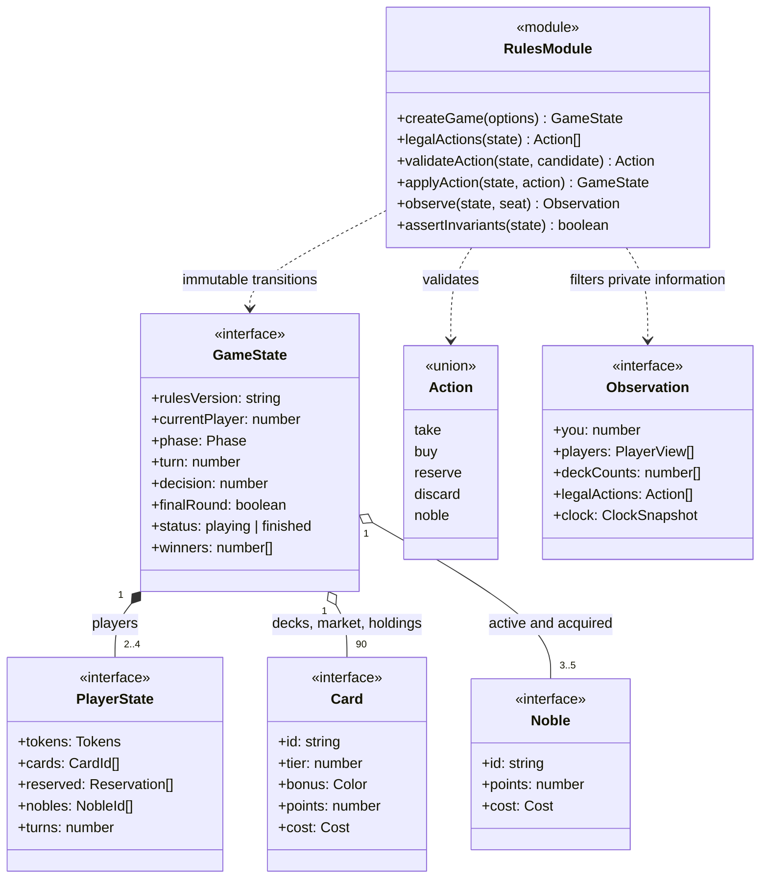
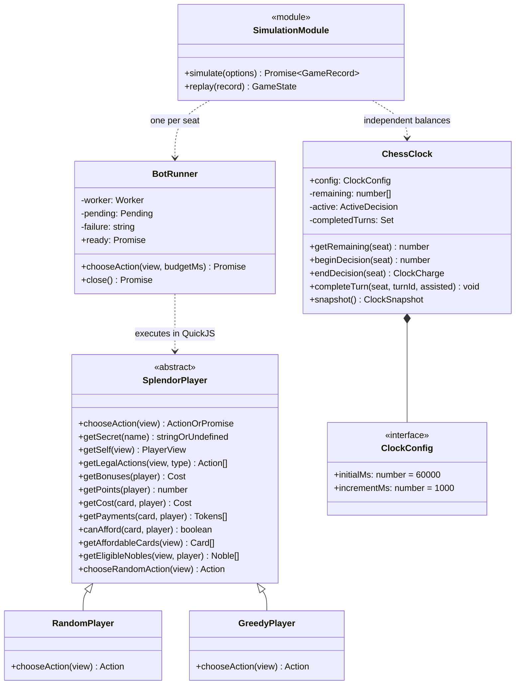
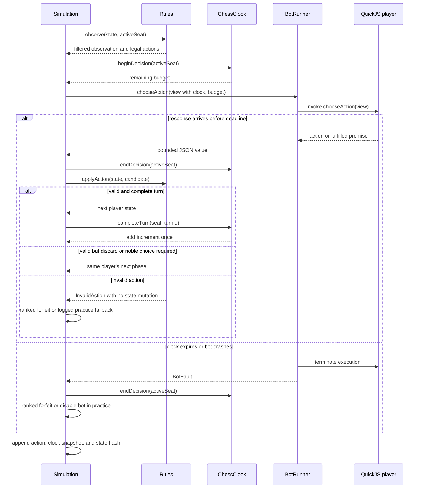
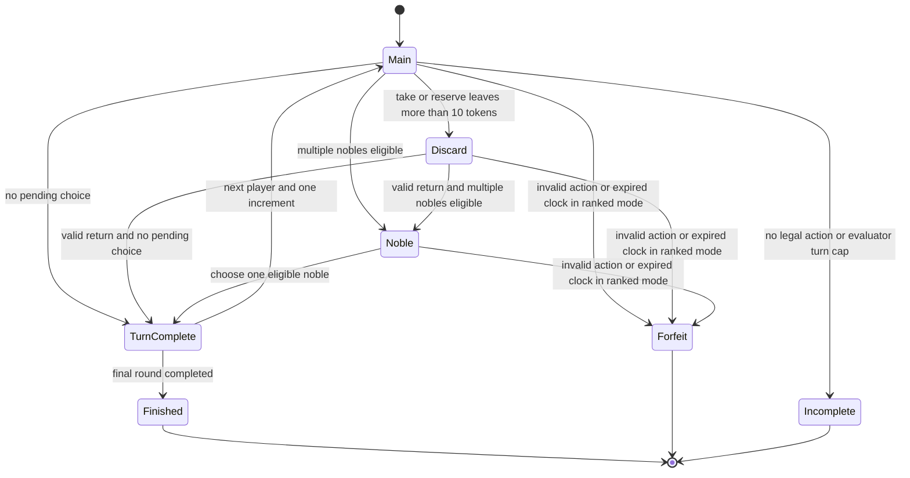
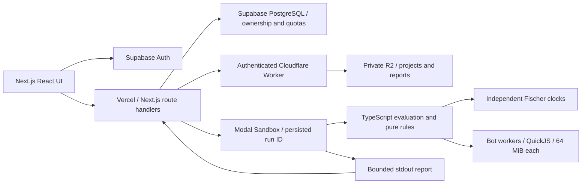
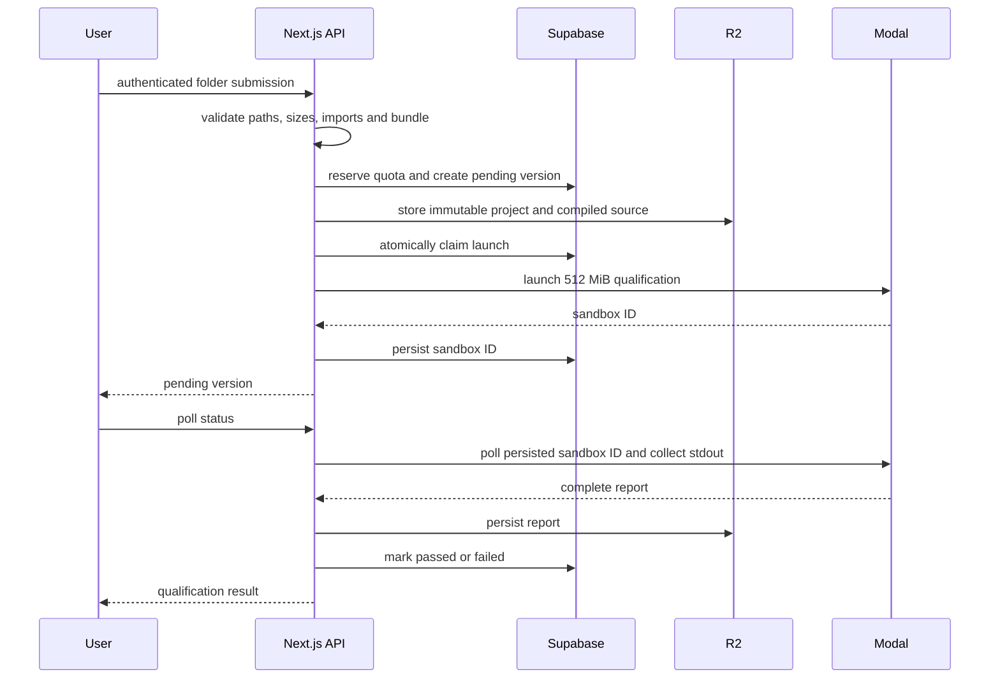
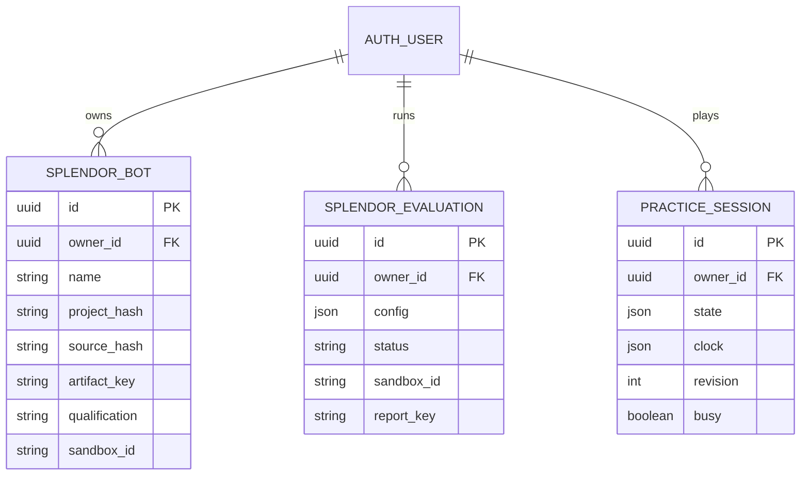
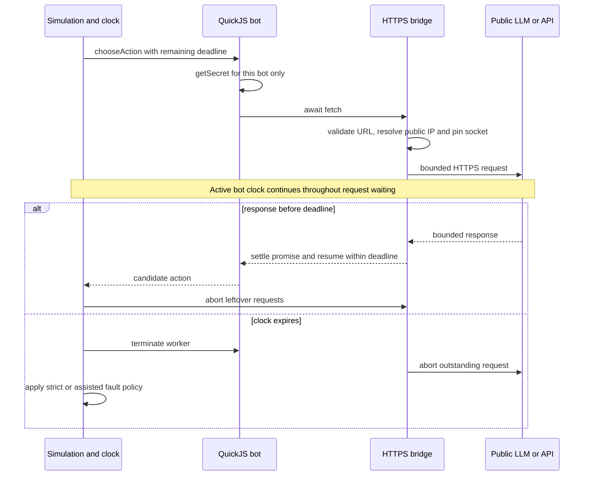

# Splendor Lab — implemented UML design

One Next.js App Router application, written in strict TypeScript, deployed on Vercel at `splendor.sudipmondal.co.in`. Supabase authenticates users and persists metadata; private R2 objects hold source projects and reports. Modal runs the same TypeScript game engine in sandboxes with outbound networking: 512 MiB for qualification/practice and 2048 MiB for strict evaluations. A QuickJS runtime isolates each bot inside the sandbox. Local development can still use SQLite and Node workers by leaving `SPLENDOR_STORAGE` unset.

## 1. Domain class diagram

The diagram uses interfaces for serializable values and classes for stateful behavior. The rules engine remains a pure module; no UI or database dependencies enter game transitions. Multiplicities describe a single vanilla game. A reservation remembers whether its card came from the public market.

## 2. Player, runner, and clock class diagram

`SplendorPlayer` is an actual TypeScript abstract class. Its compiled implementation is also the virtual `splendor` module available inside QuickJS. Helpers share payment logic with the authoritative engine and use only the observation. Subclasses may return an action or a promise. The game state, hidden decks, platform credentials, and clock mutation methods are never exposed to a bot.

## 3. Timed decision sequence

Only the active seat spends time. The host uses a monotonic clock and checks the actual completion deadline; a late response cannot win a race against an overdue timer. Observation generation, authoritative validation, rendering, queue delay, and the opponent's thinking are excluded. IPC and asynchronous response waiting are charged. Initialization has a separate 1-second execution allowance and 5-second local worker startup deadline (15 seconds in Modal), before the bot sees a game observation.

## 4. Turn state machine

The 60 + 1 clock is a competition policy around the vanilla rules. A move is a complete turn, not an individual SDK call. All mandatory decisions share the same remaining balance. No increment is awarded for a rejected move, a timeout, or a turn requiring practice assistance. No pass action or expansion rule is introduced.

## 5. Deployment components

The Next.js API verifies Supabase bearer tokens and owns all authorization. PostgreSQL RPCs atomically reserve per-user capacity. A short API call launches a Modal sandbox and persists its ID; subsequent status requests reconcile results. The daily authenticated recovery endpoint handles abandoned jobs. Sandboxes receive code and configuration over stdin, without database or storage credentials. Per-bot provider keys are decrypted only for an owner-authorized run and injected into that bot’s QuickJS context. Only bounded public HTTPS is exposed to bot code.

## 6. Submission and qualification sequence

A folder must contain `index.ts`. The server bundles only submitted relative modules and the virtual SDK, then stores an immutable project artifact. Two public baselines play four games against the candidate with swapped seats. The candidate must complete all four without faults or incomplete games. Passing is eligibility evidence; every later game still enforces time and memory limits.

## 7. Persistence model

Only the service role can access these tables directly. Route handlers expose qualified keyless public bots, the caller's private and pending versions, and owner-only evaluations and practice sessions. Public bot source is intentionally readable for learning. Source/project hashes identify immutable versions; evaluation reports include source hashes and verified game records. Runtime image IDs are pinned in deployment configuration.

## 8. Network decision and credential boundary

A bot may perform up to eight public HTTPS requests per decision, with four in flight. Requests and responses are bounded to 256 KiB and 1 MiB. Network access is unavailable during initialization or between decisions. Stored keys are authenticated to their owner and bot version with AES-GCM; a keyed fingerprint distinguishes immutable versions with different credentials. Private-key versions cannot be selected by another account. The trusted host receives no platform credentials inside Modal.

## Responsibilities and public contracts

- `Action` is a discriminated union. Invalid candidates enter the engine as `unknown`, never as trusted typed input. `applyAction` returns a new frozen state and leaves the old one intact.
- `Observation` contains public state and the receiving player's own reservations. Opponents' blind reservations remain hidden. Legal actions are generated authoritatively. The optional clock field contains read-only copies, never clock controls.
- `ClockConfig` is `{ initialMs, incrementMs }`; the web form uses seconds. Every game starts fresh. A full turn receives at most one Fischer increment, with no remaining-time ceiling. The clock is always enabled for bot evaluations.
- `GameRecord` format 2 adds final and per-event clock snapshots and decision elapsed time. Rules replay verifies the action stream without rerunning bot code or measuring new wall time. The reader still accepts legacy format 1 records from the CLI; newly created web records are format 2.
- `POST /api/bots` accepts a single source or a folder, stores an immutable version, and starts full qualification. Only passed versions enter evaluation. Failed versions expose diagnostic status to their owner.
- `POST /api/evaluations` accepts bot version IDs, mode, paired-fixture count, and clock configuration. It returns a persisted job. `GET` endpoints expose status and completed reports; the game replay endpoint reconstructs verified frames.
- `POST /api/play` creates an untimed human practice seat, accepts a versioned human action, or closes the session. The opponent uses a separate 60 + 1 clock. Stale/concurrent human moves are rejected.
- `CloudStore` owns hosted metadata and private artifact references. `LabStore` supplies the SQLite local mode. Each benchmark starts Elo at 1200; saved reports are not a persistent cross-cohort global rating ladder.

## Failure policies and deployment boundary

Strict evaluation forfeits on the first invalid move, runtime fault, or expired clock. Assisted practice logs replacement decisions and never changes Elo. An internal engine failure fails the job instead of penalizing a player. Capped games and no-legal-action positions are explicitly incomplete and unrated. A clock reaching zero cannot be revived by an increment. The clock is independent of the 400-turn simulation cap.

Bot code can call public HTTPS and LLM APIs through an asynchronous fetch bridge. DNS lookup, TLS connection, provider computation, response reading and guest promise processing all occur within the original decision deadline. Only approved public addresses are used; DNS is resolved once and the socket is pinned to a validated address. Redirects are not followed. Timeouts and turn completion abort outstanding requests and discard late callbacks. Remote services may continue their own computation after disconnection; the clock limits decision latency, not remote compute. Each seat-swapped game uses a fresh secret deal to prevent hidden-card carryover via external memory. Network responses and keys are not automatically logged; replay uses the recorded actions. Equal clocks cannot guarantee equal provider capabilities or external service stability.

Hosted execution uses a hard Modal memory limit of 512 MiB or 2048 MiB, plus a stricter 64 MiB QuickJS heap per bot and a 192 MiB Node old-space limit. These limits are distinct: qualification is not a proof of all future memory behavior. One CPU is requested and capped per sandbox. Whole-job timeout is 30 minutes; a timeout fails the job without applying partial ratings. Human practice uses a short-lived 512 MiB sandbox for each opponent response and persists its clock between requests.

A launch claim prevents duplicate launches. A crash between creating a sandbox and saving its ID can leave an orphan, bounded by the platform timeout; it cannot be silently relaunched or rated twice. Transient result-fetch failures are retried by polling. Unlaunched jobs expire after two minutes; active jobs have a 30-minute execution deadline and a one-minute recovery allowance. Reports are committed only when complete. Daily cron provides eventual cleanup; an active UI polls sooner. This is not a globally ordered rating ladder: each benchmark starts at 1200.

Current admission limits are 20 submissions and 20 evaluations per account per day, at most two pending submissions, two active evaluations, and two practice boards. Email verification remains enabled; public signup requires a configured Supabase SMTP provider. Account quotas do not replace provider-level budget limits or abuse monitoring. Automatic global matchmaking and platform-funded provider billing remain future work.
